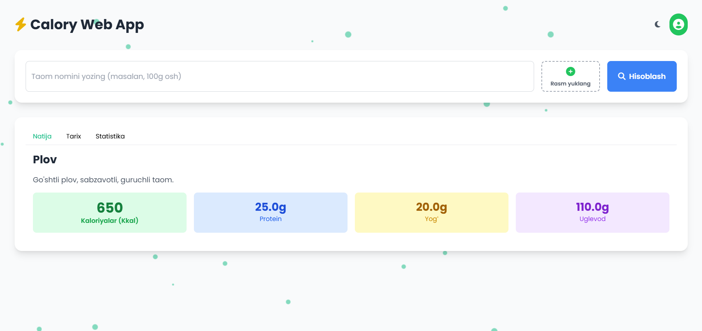
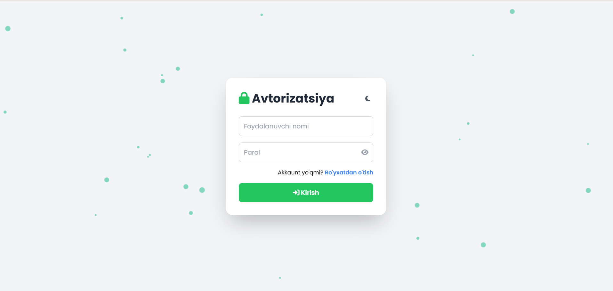
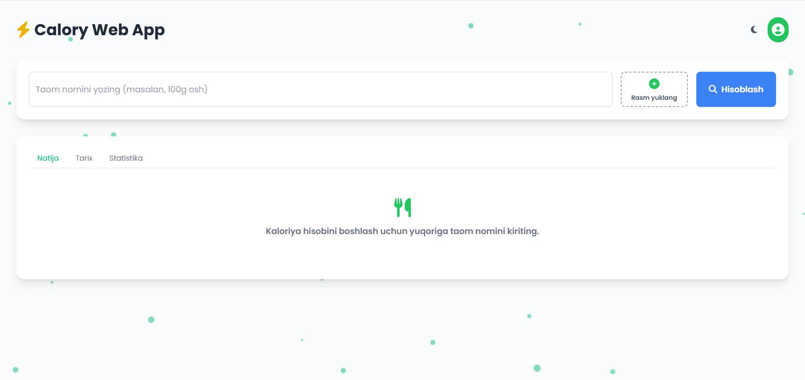
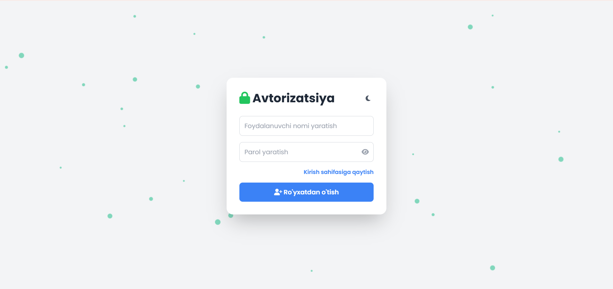
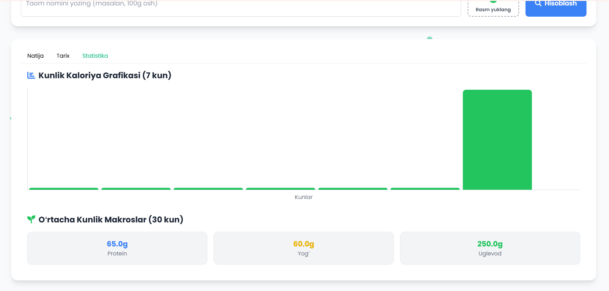
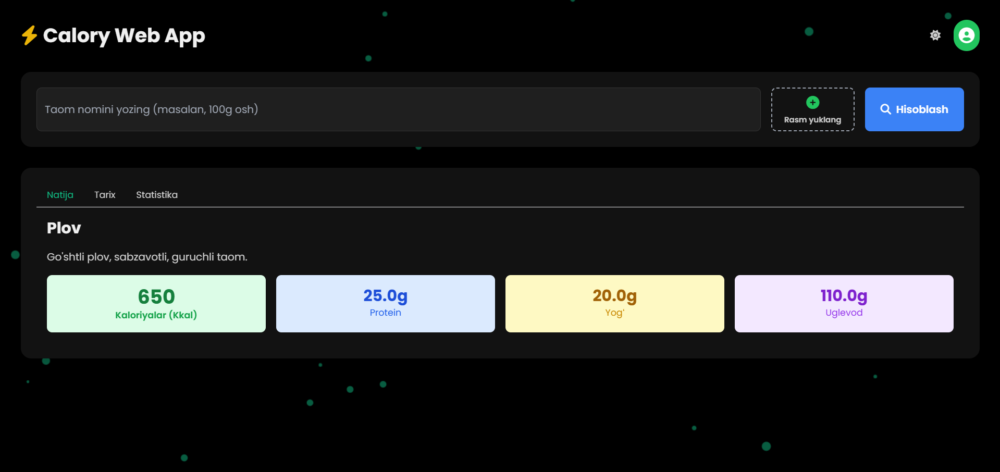

Loyihani o'zingizning kompyuteringizda ishga tushirish uchun sizga PHP server muhiti kerak bo'ladi.

1. Server Muhitini O'rnatish
PHP (va Apache/MySQL) ni ishlatish uchun quyidagi dasturlardan birini o'rnating:

XAMPP (Windows, macOS, Linux uchun eng keng tarqalgan)

WAMP (Faqat Windows uchun)

Laragon (Windows uchun qulay va zamonaviy)

Dasturni o'rnatgandan so'ng, Apache va PHP modullarini ishga tushiring.

2. Loyihani Server Katalogiga Joylashtirish
O'rnatilgan mahalliy serveringizning veb-katalogiga o'ting:

XAMPP/WAMP/Laragon uchun: Odatda htdocs/ yoki www/ katalogi.

htdocs/ katalogi ichida calory-web-app/ nomli yangi katalog yarating.

Loyihaning barcha fayllarini (index.html, script.js, api/, db/) shu calory-web-app katalogi ichiga ko'chiring.

3. Konfiguratsiya (Kalitni Kiritish)
api/calculate.php faylini oching.

OPENROUTER_API_KEY qatoriga o'zingizning haqiqiy OpenRouter API kalitini joylashtiring.

4. Ma'lumotlar Bazasini O'rnatish
O'zi avtomatik yaratiladi jsonda

5. Ishga Tushirish
Brauzeringizda asosiy manzilga o'ting:

http://localhost/ai-calorie-tracker/
Siz Kirish (Login) sahifasini ko'rishingiz kerak.

Ro'yxatdan o'tishni sinab ko'ring va kaloriya hisoblash funksiyasidan foydalaning.

<<<<<<< HEAD
Demo : https://dilshodsayfiddinov12.alwaysdata.net/calory-web-app/

## 📸 Loyihadan screenshotlar

### 🔢 Calculated Page

### 🔐 Login Page

### 🏠 Main Page

### 👤 Profile Page

### 📝 Register Page

### 📊 Stats Page

=======

### 🌑 Dark mode

=======

Demo :
https://dilshodsayfiddinov12.alwaysdata.net/calory-web-app/

